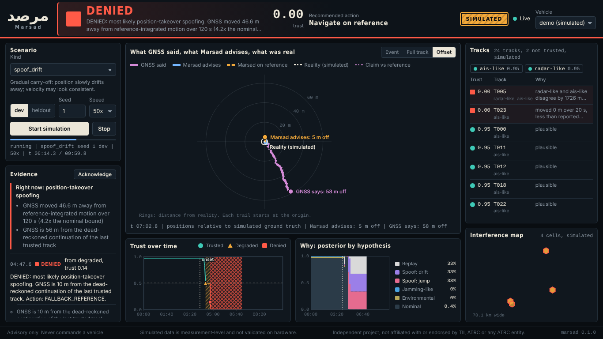

# Marsad (مرصد)

**Position-trust layer for autonomous systems and decision platforms.**

Marsad answers one question: *can I believe this position?* It detects GNSS jamming and spoofing, separates
"GNSS is degraded" from "GNSS is lying", scores the integrity of positions coming from vehicles and from
multi-source tracks, explains its reasoning, and recommends a fallback navigation mode. The core is
hardware-independent and standard-library only; it speaks PX4 ULog, MAVLink and ROS 2, serves a REST/SSE API and an
operator dashboard, and exposes an **MCP server** so AI agents and decision platforms can use it as a tool.


<sub>Operator dashboard during a SIMULATED carry-off: what GNSS said (purple), what Marsad advises (orange), what was real (white).</sub>

> **Independence notice.** Marsad is an independent open-source project. It is not affiliated with, endorsed by, or
> sponsored by the Technology Innovation Institute (TII), the Advanced Technology Research Council (ATRC), or any of
> their entities.
>
> **Validation status.** All results below are from *measurement-level simulation*. Nothing has been run on a real
> flight controller or real interference data yet. See [docs/VALIDATION.md](docs/VALIDATION.md) for exactly what is and
> is not demonstrated.

## Why this exists

GNSS interference in the Gulf is no longer an anomaly. Public reporting from 2026 describes hundreds of jamming
incidents off the UAE coast and vessel positions displaced onto airports and inland sites. The nastiest case is
**carry-off spoofing**: a slow drift that stays under the sanity checks autopilots use for noise and faults, because
a navigation filter absorbs slow drift as real motion. Navigation without GNSS exists. What is missing is the layer
that **decides when to switch to it**, and, one level up, a way for a decision platform to stop inheriting poisoned
positions from the tracks it fuses.

## What it does

| Module | For | Output |
|---|---|---|
| **Vehicle trust** | Autopilots, companion computers, robots | Trust score, `TRUSTED / DEGRADED / DENIED`, recommended navigation action, fallback position, human-readable evidence |
| **Track trust** | Decision-support platforms, C2, AI agents | Per-track and per-source trust with reasons: plausibility, replay, forbidden zones, circle-pattern signature, cross-source disagreement, source-level common-mode offset |
| **Interference map** | Mission planners | Hex-binned, time-decayed interference confidence (GeoJSON) |
| **MCP server** | AI agents | `assess_vehicle_window`, `score_track`, `list_distrusted_tracks`, `explain_state`, … |

## Results (simulated, held-out seeds, 30 per scenario)

| | Marsad | simplified autopilot-style gate |
|---|---|---|
| Position takeover (jump / replay) detected | 100%, median **0.1 s** | 100%, 0.1 s — but accepts the spoofed position again after its latch: median error **430 m** vs **8 m** |
| Stealth carry-off (no power signature) detected | **100%**, median 58 s | **0%** |
| Carry-off with power signature detected | 100% | 0% |
| Navigation error, carry-off (median of max) | **~20 m** (raw GNSS 145 m and growing) | 144 m |
| Jamming (hard / soft) detected | 100% / 100%, 2.4 s / 5.0 s | 100% / 100% |
| Signal obstruction → DENIED | **0%** of runs | 100% |
| Multipath → DENIED | **3%** of runs (1 of 30) | 77% |
| Nominal flights with any alarm | 0% | 0% |
| Engine cost | ~185 µs / sample, stdlib only | |

**Where it does not work** (reported in [docs/EVALUATION.md](docs/EVALUATION.md)): without an independent motion
reference carry-off detection falls to 53% (labelled `spoofing_unclassified`) and there is no fallback position; drifts of 0.1 m/s are detected in only ~50% of runs and 0.05 m/s never; an attack at power-up has no clean baseline; in soft jamming the simple baseline's navigation error is
slightly *better* in latency (5.0 s vs 4.1 s) and equal in navigation error. Track-trust results (precision/recall 1.00 on simulated scenes) come from a simulator and detectors
with the same author and should be read accordingly ([docs/TRACKS.md](docs/TRACKS.md)).

## Design in one picture

```
 ULog / MAVLink / ROS 2 / simulator ──► adapters ──► NavSample stream (GNSS fix + independent velocity reference)
                                                       │
                     signal · kinematic · inertial/reference · timing detectors  → log-likelihood evidence
                                                       │
                recursive multi-hypothesis fusion (environmental, jamming, spoof-jump, spoof-drift, replay)
                                                       │
        state machine (hysteresis, anchor rewind, re-acquisition verified against dead-reckoning)
                                                       │
            TrustReport ──► MAVLink (advisory) · ROS 2 · REST/SSE · MCP · dashboard · interference map
```

## Quick start

```bash
git clone https://github.com/hudasol/marsad && cd marsad
python -m venv .venv && . .venv/bin/activate            # Windows: .venv\Scripts\activate
pip install -e ".[dev]"
pytest                                                   # ~1 min

marsad demo spoof_drift_stealth --seed 4                 # state transitions with evidence (SIMULATED)
marsad serve                                             # dashboard + API at http://127.0.0.1:8000
marsad mcp                                               # MCP server on stdio (see docs/MCP.md)
marsad bench --split heldout --seeds 30                  # reproduce the benchmark
marsad make-log --kind spoof_drift --out sim.ulg         # SYNTHETIC PX4-style ULog
marsad inspect real_flight.ulg && marsad replay real_flight.ulg   # your own PX4 log
```

Use it as a library:

```python
from marsad import TrustEngine, preset, NavSample, GnssFix, RefMotion

engine = TrustEngine(preset("uav_multirotor"))
report = engine.update(NavSample(t=12.4,
    gnss=GnssFix(t=12.4, lat=24.45, lon=54.38, ve=8.1, vn=2.0, cn0_mean=41.0, cn0_std=3.1, n_sats=13, agc=0.31),
    ref=RefMotion(t=12.4, ve=8.0, vn=2.1)))            # ref = visual odometry / optical flow / odometry
print(report.state, report.trust, report.action, report.summary)
```

## Documentation

[Build plan](plan.md) · [Evaluation](docs/EVALUATION.md) · [Technical report](docs/TECHNICAL_REPORT.md) ·
[One-pager](docs/ONE_PAGER.md) · [Validation status](docs/VALIDATION.md) · [Adapters](docs/ADAPTERS.md) ·
[Track trust](docs/TRACKS.md) · [API](docs/API.md) · [MCP](docs/MCP.md) · [Dashboard](docs/DASHBOARD.md) ·
[Milestones](docs/MILESTONES.md) · [Security & responsible use](SECURITY.md)

## What it is not

- Not a GNSS receiver or RF analyser.
- Not a substitute for authenticated GNSS or controlled-reception antennas; it complements them where they are absent.
- **Not an attack tool.** The simulator models attacks at the measurement level only. There is no RF signal
  generation, SDR code, or spoofing waveform synthesis in this repository.
- Does not command vehicles (the MAVLink reporter can only emit trust values and status text; enforced by a test).
- Does not attribute interference to any actor.

## Roadmap

| Tag | Content |
|---|---|
| `v0.1.0` | Core engine, detectors, fusion, state machine, simulator, benchmark harness |
| `v0.3.0` | Track-trust module, interference map |
| `v0.4.0` | PX4 ULog, MAVLink, ROS 2 adapters |
| `v0.6.0` | REST/SSE service, MCP server, dashboard |
| `v1.0.0` | Held-out evaluation, ablations, CI, container, technical report |
| next | Real PX4 log replay → SITL → advisory companion computer → closed loop in an authorised range |

## License

Apache-2.0. See [`LICENSE`](LICENSE).
