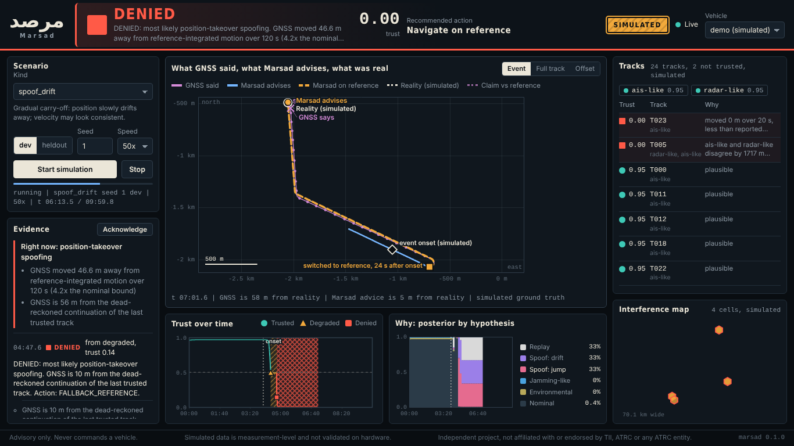
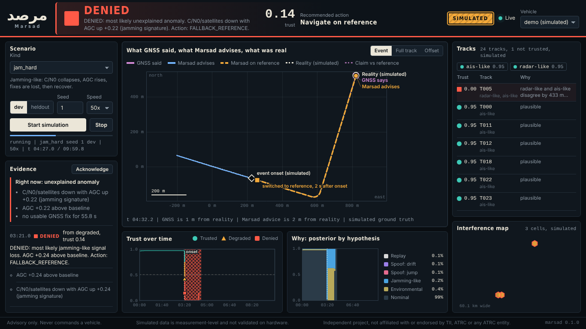

# Operator dashboard

A static single-page console served at `/` by `python -m marsad.api`. No build step, no CDN, no web fonts,
no network requests except to the same server's `/v1` API, so it works fully offline (a test enforces
that the shipped files contain no external URLs). Files: `src/marsad/dashboard/{index.html,app.js,style.css}`.

```bash
pip install -e ".[api]"
python -m marsad.api            # open http://127.0.0.1:8000
```

With `MARSAD_API_KEY` set, open `http://127.0.0.1:8000/#key=YOUR_KEY`.

> Screenshots below show **SIMULATED** data from the measurement-level simulator (seed 1, dev split).
> Nothing on them comes from hardware. The simulator has no RF or waveform code.






## Panels

* **State banner (top).** One word and shape for the state (circle TRUSTED, triangle DEGRADED, square
  DENIED), the trust score, and the recommended action. A hatched SIMULATED badge shows whenever the data
  on screen is simulated. The connection chip shows Live, Connecting, or Disconnected with a retry countdown;
  while disconnected the data dims and reconnection uses exponential back-off.
* **What GNSS said, what Marsad advises, what was real (centre).** A local-frame plot in metres.
  Orchid is the raw GNSS track; blue is Marsad's advised position; amber dashes mark the segment where
  Marsad advises navigating on the independent reference (fallback); the dotted white line is simulated
  ground truth (demo only). A diamond marks event onset and an amber square marks the switch to the
  reference, with the delay. Thin whiskers show how far GNSS claimed to be from the reference.
  Three views: *Event* (zoom on the last two minutes or the event), *Full track*, and *Offset* (demo only;
  every position relative to ground truth, which makes slow carry-off visible when the vehicle's own travel
  would otherwise swamp a 50 m drift).
* **Trust over time.** Trust score with state bands (hatching differs per state, so colour is not the only cue).
* **Posterior by hypothesis.** Stacked posterior over time with the current values listed.
* **Evidence.** Current ranked evidence in plain language, then a feed of state changes with the evidence
  behind each, plus the operator Acknowledge button (REST `acknowledge`).
* **Scenario.** Pick any simulated kind, dev or heldout split, seed and speed, then Start or Stop.
* **Tracks.** Sorted most distrusted first, with reasons and source-health chips; a flagged source gets a
  square marker and the word "flagged" (no attribution of intent).
* **Interference map.** Projected hex cells from `/v1/map/interference`, fill by confidence. Cells that
  would be smaller than a marker are enlarged. An empty map means no events were reported, not that
  there is no interference.

## Accessibility and robustness

Keyboard reachable controls with visible focus; a skip link; ARIA labels on canvases; state changes are
announced through a live region; `prefers-reduced-motion` disables the one pulse animation; state is
encoded by shape and hatching as well as colour (blue, orange, vermilion, orchid palette, no red-green
pair); layout verified at 1366x768 and 1280x800, and collapses to one column below 1100 px.
The server uses a system font stack that renders Arabic (the wordmark is مرصد).

## Reproducing the screenshots

Start the server, drive the page with Playwright (chromium), pick a scenario, wait, capture. The
screenshots in `docs/img/` were taken 6 to 8 seconds after starting a 50x demo, with no console errors.
