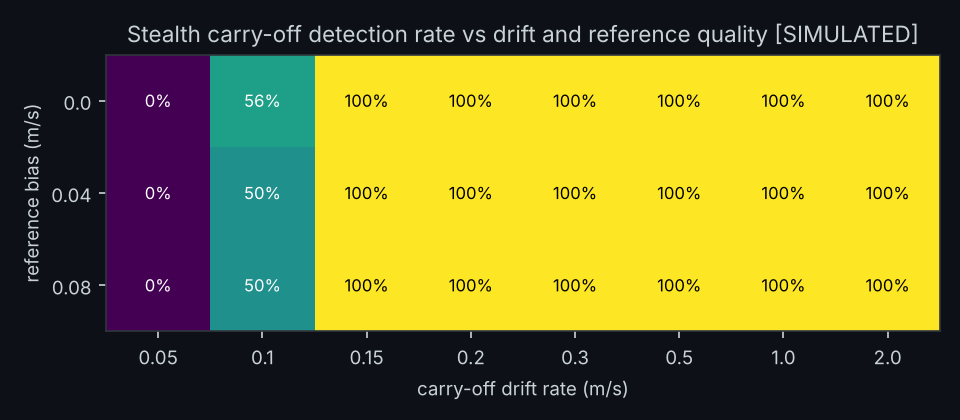
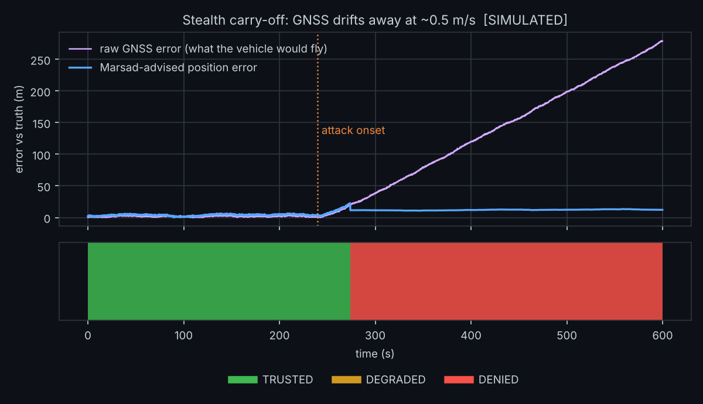
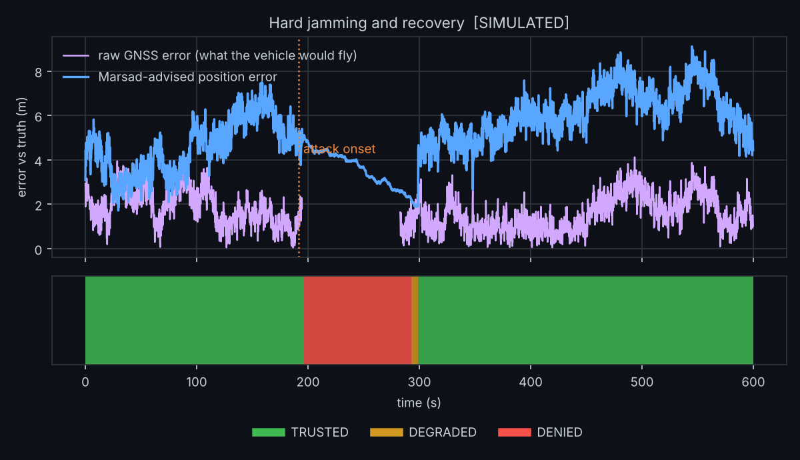
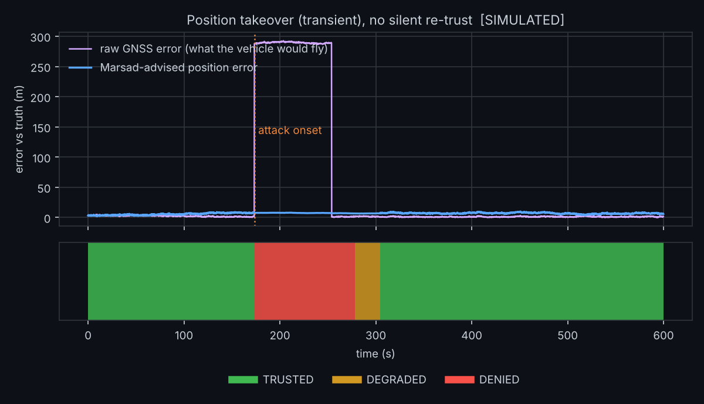

# Evaluation

**Everything on this page is SIMULATED.** The scenarios come from `marsad.sim`, a measurement-level
model of what a GNSS receiver and a reference sensor would report. No flight data, no RF, no hardware.
Read the results as "the method works against this threat model", not "Marsad is validated in the field".

Reproduce: `python scripts/run_eval.py` (about 12 minutes on 4 cores). Raw results: `docs/results/*.json`.

## Method

* **Scenarios (12).** `nominal`; benign: `benign_obstruction`, `benign_multipath`; jamming: `jam_hard`, `jam_soft`;
  spoofing: `spoof_jump`, `spoof_jump_transient`, `spoof_drift` (carry-off with a power signature),
  `spoof_drift_stealth` (no power signature, velocity-consistent), `replay` (meaconing); and two failure-regime
  cases, `spoof_drift_noref` (no reference sensor) and `spoof_drift_ref_outage` (reference lost for 30–60 s).
  600 s, 5 Hz, a manoeuvring UAV at 8–16 m/s, correlated GNSS error (1.2 m, 30 s correlation), a reference
  velocity sensor with bias up to 0.06 m/s (dev) / 0.08 m/s (held-out).
* **Splits.** Detector thresholds were tuned on the **dev** split only. The **held-out** split uses different
  seeds and *different or more adversarial parameter ranges* (slower and faster carry-off than dev, weaker
  spoofer power, longer replay delays, smaller and larger jumps, larger reference bias). Held-out parameters
  were fixed before the final run, and no threshold was changed after it. Disclosure: one 6-seed smoke run of
  the held-out split was looked at before the final run to check the pipeline; nothing was tuned on it.
* **Baseline.** `marsad.bench.GateBaseline`, a *simplified autopilot-style* gate: fix type, satellite count,
  a 5σ position-innovation gate, a 10 s latch, dead-reckoning on the **same** reference sensor while latched.
  It is a stand-in for common practice, **not PX4's actual implementation**, and it is cheap to beat in places
  by construction. The comparison isolates detection logic, not sensors.
* **Metrics.** Detection = state leaves TRUSTED after onset. Latency = onset to first non-TRUSTED. Navigation
  error = distance between the *recommended* position and truth after onset (what the vehicle would fly on),
  compared with the raw GNSS error and the baseline. False-alarm behaviour on benign scenarios = fraction of time
  not TRUSTED and fraction of runs reaching DENIED. `no-fallback time` = fraction of post-onset time Marsad
  recommended HOLD_AND_ALERT (it has nothing to navigate on).

## Results, held-out split (30 seeds per scenario, fresh seeds)

Version 1.1.0. Seeds were drawn fresh (held-out 5000+, ablation 6000+, sweep 7000+) after the 1.1 changes, because the
v1.0.0 held-out seeds had been seen while those changes were designed. The v1.0.0 results are kept in
`docs/results/v1.0.0/`. Parameters were not re-tuned against these seeds.

| scenario | detected: Marsad | detected: gate baseline | latency med / p90 (s): Marsad | max nav error med (m): Marsad / baseline / raw GNSS | class at first alarm (coarse) / settled (fine) |
|---|---|---|---|---|---|
| jam_hard | 100% | 100% | 2.4 / 4.5 | 6 / 7 / 4 | 93% / 100% |
| jam_soft | 100% | 100% | 5.0 / 6.1 | 11 / 11 / 22 | 83% / 83% |
| spoof_jump | 100% | 100% | 0.1 / 0.2 | **8 / 430 / 430** | 100% / 100% |
| spoof_jump_transient | 100% | 100% | 0.1 / 0.2 | **6 / 269 / 266** | 100% / 100% |
| spoof_drift | 100% | **0%** | 27 / 90 | **18 / 411 / 413** | 100% / 90% |
| spoof_drift_stealth | 100% | **0%** | 58 / 89 | **20 / 144 / 145** | 100% / 100% |
| replay | 100% | 100% | 0.1 / 0.2 | **10 / 712 / 709** | 100% / 97% |
| spoof_drift_noref *(failure regime)* | **53%** | 0% | 33 / 59 | 99 / 243 / 245 (45% of time no fallback) | 100% / 47% |
| spoof_drift_ref_outage *(failure regime)* | 100% | 0% | 41 / 138 | 37 / 121 / 121 (40% no fallback) | 100% / 87% |

| benign scenario | time not-TRUSTED: Marsad | runs reaching DENIED: Marsad | runs reaching DENIED: baseline |
|---|---|---|---|
| nominal | 0% | 0% | 0% |
| benign_obstruction | 85% (DEGRADED) | **0%** | 100% |
| benign_multipath | 2% | **3%** (1 of 30 runs) | 77% |

Changes versus v1.0.0 (same scenarios, different seeds, so small differences are within seed noise): the replay
event is now labelled `replay_meaconing` (with an estimated delay) instead of a position jump; carry-off with a
power signature went from 97% to 100%; soft jamming latency is 5.0 s (was 5.7) and navigation error equals the
baseline's (11 m); the stealth carry-off detection latency did not improve on the median (58 s vs 53 s).
Regressions: one multipath run (3%) now reaches DENIED (was 0 of 30), and engine cost is about four times higher.

Dev split numbers are in `docs/results/dev.md`.

### What the numbers do and do not say

* **The baseline catches every abrupt event and none of the gradual ones.** Its innovation gate is designed for
  noise and faults, and a slow carry-off stays under it by construction.
* **Even when the baseline detects a jump it ends up wrong.** After the latch expires it accepts the spoofed
  position again (430 m median error). Marsad keeps the offset latched until the GNSS agrees with the
  dead-reckoned continuation of the last trusted track.
* **Marsad is not better at everything.** In `jam_soft` the baseline's latency is lower (4.1 s vs 5.0 s); navigation
  error is equal (11 m). Marsad's rewind-to-onset anchor is deliberately conservative.
* **Class accuracy:** jamming vs spoofing vs environmental is separated well when AGC is available. A `replay`
  is now labelled `replay_meaconing` in 97% of runs once a delay (lag) is confirmed by cross-correlating GNSS
  and reference velocity; at the very first alarm the label is still the coarse one. Without a reference sensor a
  carry-off is reported as `spoofing_unclassified` (the fine label is right in 47% of those runs). Jump vs. drift
  labelling is imperfect in ~10% of power-signature carry-off runs.
* **Obstruction is DEGRADED for most of its duration by design.** The product claim is "does not deny good
  navigation", not "stays silent".

## Ablation (held-out, fresh seeds)

`docs/results/ablation.md`. Removing a detector:

| removed | consequence |
|---|---|
| inertial/reference | stealth carry-off detection drops from 100% to **0%**; carry-off with a power signature from 100% to 45% |
| signal | jamming latency about doubles; carry-off latency 39 s → 103 s; obstruction can reach DENIED (5% of runs) |
| kinematic | jump/replay latency 0.1 s → 1.5 s (still caught by the others) |
| timing | no measurable change on these scenarios (the simulator rarely exercises clock steps) |

The reference sensor is the single biggest factor for carry-off, which is why the adapters warn loudly when only
an EKF-fused (GNSS-contaminated) velocity is available.

## Detectability floor for carry-off

`docs/results/detectability.md` sweeps carry-off rate × reference bias. Without a power signature, drifts of
0.05 m/s are **never** detected, 0.1 m/s in about 50–56% of runs (after ~4–5 minutes), and 0.15 m/s and faster in
100% of runs (0.15 m/s after ~2.3 minutes). In v1.0.0 the 0.15 m/s cell was 0–38%; the improvement comes from the
slow reference-bias estimator and the 240 s window. The sweep is on fresh seeds and the bias values are bounds of
the simulated reference sensor. The floor comes from the reference
bias bound and the sensor noise integrated over the window, not from the code path.

## Case studies

## Performance

About 185 µs per sample (3000 samples in 0.56 s, CPython 3.13, one cloud core, engine only; v1.0.0 was 46 µs,
the increase is the replay cross-correlation and the longer drift windows). Memory is bounded: the longest drift window is 240 s, history is pruned at 1.6× that. This is still
well inside the budget for 5–50 Hz. The core is
standard-library only. A compiled port is not needed for 5–50 Hz companion-computer use; it would be for
microcontrollers.

## Threats to validity

1. **Same author for simulator and detectors.** Held-out splits mitigate over-fitting to parameters but not to
   the model. Real receivers have failure modes the simulator does not have.
2. **Idealised reference sensor.** Bias is bounded and white noise is Gaussian. A real visual-odometry system
   drops out, scale-drifts, and fails in featureless terrain or over water.
3. **Simple GNSS error model.** No ionospheric events, no multi-constellation geometry, no receiver-specific
   C/N0 behaviour, no real AGC scale.
4. **Baseline is a stand-in.** Do not read the table as "Marsad beats PX4".
5. **Held-out seeds are not independent of the design.** The 1.1 changes were developed while looking at v1.0.0
   results; the numbers above are on fresh seeds but the same scenario family.
6. **Spoofer model is measurement-level.** A spoofer that also manipulates C/N0 statistics to match baselines,
   or that manipulates the reference sensor, is outside the model (see below).

## Not handled (by design or by limit)

* Attack at power-up (no clean baseline to learn).
* A coordinated attack that also corrupts the reference sensor (the reference must be independent).
* Slow drift below roughly 0.1 m/s (undetected or only after minutes): the reference sensor's residual bias and noise,
  integrated over the window, bound what can be seen.
* After a long outage with no reference, re-acquisition is unverifiable; the state stays DEGRADED until an
  operator acknowledges (`engine.acknowledge()`).
* Multipath excursions that do not revert within 4 s are indistinguishable from a small jump at onset.
